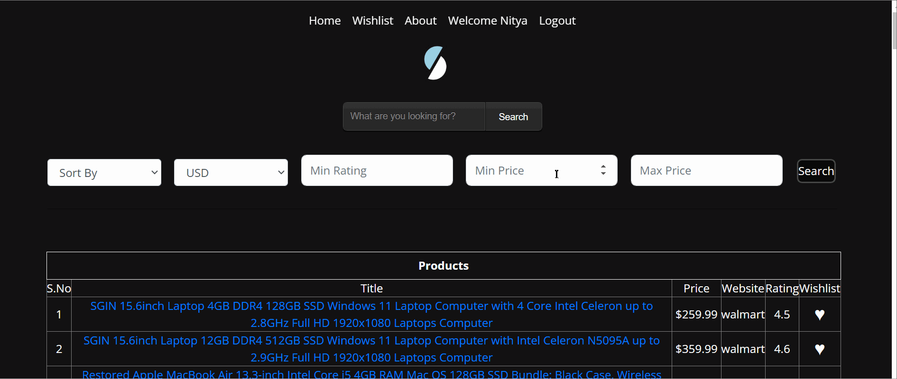
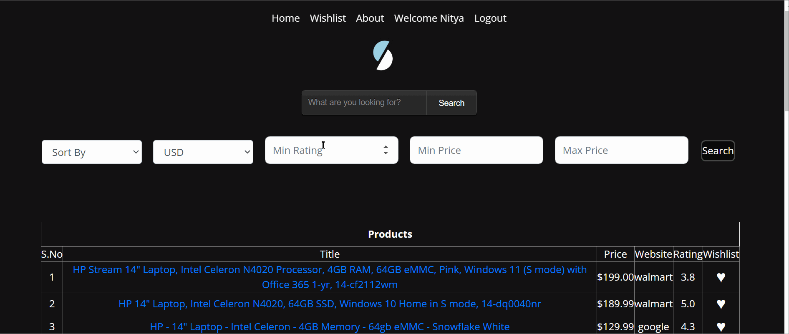
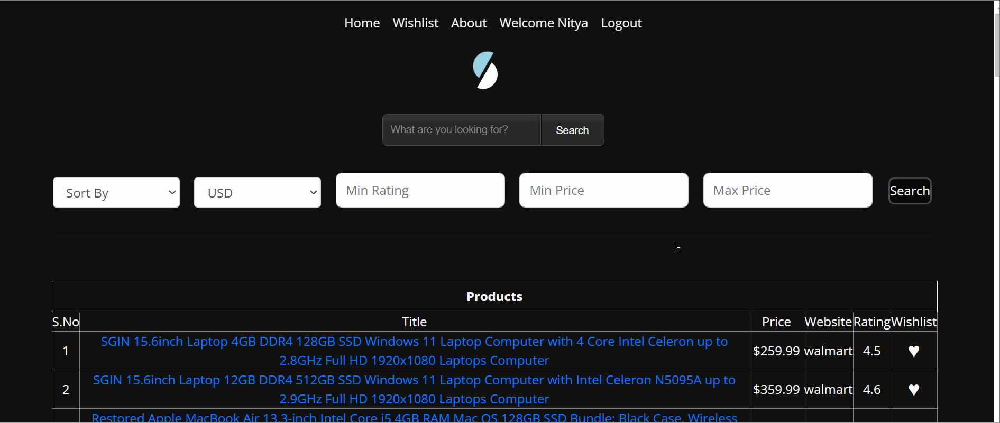

# SLASH
Slash Your Spending, Not Your Style - Unleash the Best Deals!!

<p align="center"></p>

[](https://github.com/csc510fall23g45/slash/blob/main/LICENSE)
[](https://zenodo.org/doi/10.5281/zenodo.10020460)

[](https://github.com/csc510fall23g45/slash/issues)
[](https://github.com/csc510fall23g45/slash/issues?q=is%3Aissue+is%3Aclosed)
[](https://github.com/csc510fall23g45/slash/pulls?q=is%3Apr+is%3Aclosed)
[](https://codecov.io/gh/csc510fall23g45/slash)
[](https://github.com/csc510fall23g45/slash/actions/workflows/style_checker.yml)

Slash is a tool that scrapes the most popular e-commerce websites to get the best deals on searched items across these websites. 
- **Fast**: With slash, you can save over 50% of your time by comparing deals across websites within seconds
- **Easy**: Slash uses very easy commands to filter, sort and search your items
- **Powerful**: Quickly alter the commands to get desired results

# :rocket: Quick Guide

1. Access the Github repository from your computer. 
 - First, pre-install [git](https://git-scm.com/) on  your machine. 
 - Then, clone the repo using the following command:
 ```
 git clone https://github.com/csc510fall23g45/slash
 ```
 * Finally, ```cd``` into the local repository.
```
cd slash
```
2. Install the ```requirements.txt```. 
- This project uses Python 3, so make sure that [Python](https://www.python.org/downloads/) and [Pip](https://pip.pypa.io/en/stable/installation/) are preinstalled.
- Install the ```requirements.txt``` file using pip.
```
pip3 install -r requirements.txt
```
3. Running the program

- Set the environmental variable using either of the following commands:
 ```
MAC
export FLASK_APP=./src/modules/app
flask run

Windows Command Prompt
set FLASK_APP=.\src\modules\app 
flask run

Windows Powershell
$Env:FLASK_APP='.\src\modules\app'
flask run
```

4. Once flask is running, open your internet browser and type ```http://127.0.0.1:5000/``` into the search bar.

Note: To get the share by email functionality. Please email slash.se23@gmail.com to get the config file.

<p>
 
# :dizzy: What's New ?

### Enhanced UI
<p> ....  </p>
<p align="center"></p>

### Updated Wishlist
<p> .... </p>
<p align="center"></p>

### Wishlist share
<p> ....</p>
<p align="center"></p>

### User login with password
<p> ...</p>
<p align="center"></p>

### Dockerization
<p> ... </p>
<p align="center"></p>


:movie_camera: Checkout our demo video
---

[](https://www.youtube.com/watch?v=aGQisQmQt-o)

# :muscle: What's next for future development?

- Creating ordering and payment functionality for customers to directly order from Website.
- Adding Password for login page.
- Provide parameters like in-store availability.
- Increase the number of filters.
- Pagination Feature: Implement a pagination feature for the result table allowing to scrape and display multiple results from various e-commerce sites in an organized manner.
- Additional Account Settings: Introduce additional account settings to give users more control over their profiles and preferences, enhancing their personalization and usability.
- Predictive Model: Develop a predictive model that can determine the optimal timing for purchasing the least expensive product from the search results. This feature will provide valuable guidance to users, helping them make informed decisions.
- Enhanced Search Capabilities: Improve the search functionality by introducing advanced search capabilities. This can include options for filtering search results based on ratings, price ranges, and other relevant criteria, giving users more refined search options.
- Multi-Platform Integration: Expand the platform's capabilities by incorporating search results from various e-commerce platforms such as Etsy, Dick's Sporting Goods, and more. This will provide users with optimized outcomes from a diverse selection of online vendors.
- Highlight Cheapest Product: Highlight the most affordable product in the result table and display it separately for an easier user experience. This feature can help users quickly identify the best deals.
- Social Media Login: Add support for different methods of login, such as Gmail, Facebook, or other social media accounts, to provide users with convenient and secure login options.
- Price Chart Visualization: Introduce a visual representation of price trends for products. This feature can help users understand historical price changes and make more informed purchasing decisions.
- UI Enhancement: Continue to enhance the user interface to provide an even better user experience. Consider improving aesthetics, user-friendliness, and overall design.


:thought_balloon: Use Case
---
* ***Students***: Students coming to university are generally on a budget and time constraint and generally spend hours wasting time to search for products on Websites. Slash is the perfect tool for these students that slashes all the unnecessary details on a website and helps them get prices for a product across multiple websites.Make the most of this tool in the upcoming Black Friday Sale.
* ***Data Analysts***: Finding data for any project is one of the most tedious job for a data analyst, and the datasets found might not be the most recent one. Using slash, they can create their own dataset in real time and format it as per their needs so that they can focus on what is actually inportant.
  
# Additional Information
 For Additional Information direct to this [page](https://github.com/SE23-Team44/slash/tree/main/docs)  and check all the markdown files 

# Chat Channel

<code><a href="https://discord.gg/duCqfCS6EA" target="_blank"></a></code>


:sparkles: Contributors
---
<table>
  <tr>
    <td align="center"><a href="https://github.com/dhirajv2000"><br /><sub><b>Dhiraj Venugopal</b></sub></a><br /></td>
    <td align="center"><a href="https://github.com/Sharatn7"><br /><sub><b>Sharat Neppali</b></sub></a><br /></td>
    <td align="center"><a href="https://github.com/sathiya06"><br /><sub><b>Sathiya Narayanan Venkatesan</b></sub></a></td>
    <td align="center"><a href="https://github.com/aadithya-naresh"><br /><sub><b>Aadithya Naresh</b></sub></a><br /></td>
</tr>
</table>

:email: Support
---
For any queries and help, please reach out to us at dhj165@hotmail.com, sarathn08@gmail.com.
