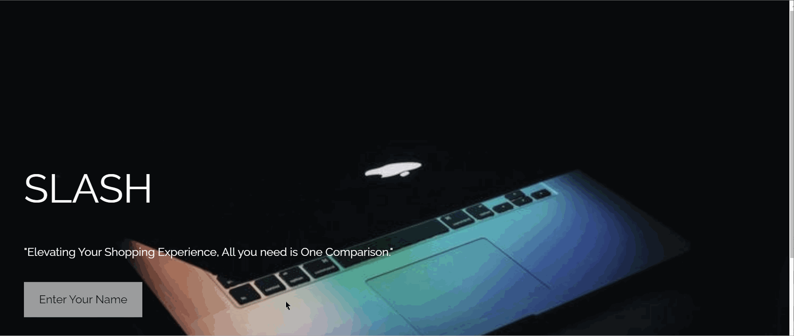
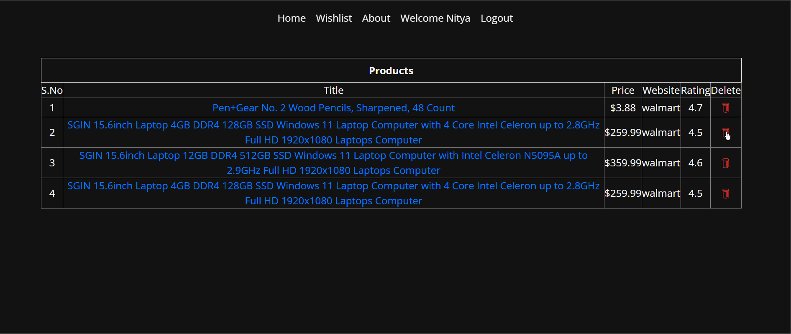
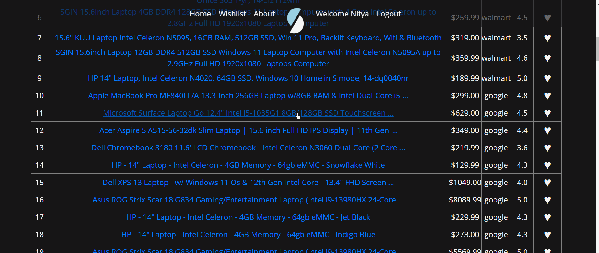

# SLASH
Slash Your Spending, Not Your Style - Unleash the Best Deals!!

<p align="center"></p>

[](https://github.com/csc510fall23g45/slash/blob/main/LICENSE)
[](https://zenodo.org/doi/10.5281/zenodo.10020460)

[](https://github.com/csc510fall23g45/slash/issues)
[](https://github.com/csc510fall23g45/slash/issues?q=is%3Aissue+is%3Aclosed)
[](https://github.com/csc510fall23g45/slash/pulls?q=is%3Apr+is%3Aclosed)
[](https://codecov.io/gh/csc510fall23g45/slash)
[](https://github.com/csc510fall23g45/slash/actions/workflows/style_checker.yml)

Slash is a tool that scrapes the most popular e-commerce websites to get the best deals on searched items across these websites. 
- **Fast**: With slash, you can save over 50% of your time by comparing deals across websites within seconds
- **Easy**: Slash uses very easy commands to filter, sort and search your items
- **Powerful**: Quickly alter the commands to get desired results

# :rocket: Quick Guide

1. Access the Github repository from your computer. 
 - First, pre-install [git](https://git-scm.com/) on  your machine. 
 - Then, clone the repo using the following command:
 ```
 git clone https://github.com/csc510fall23g45/slash
 ```
 * Finally, ```cd``` into the local repository.
```
cd slash
```
2. Install the ```requirements.txt```. 
- This project uses Python 3, so make sure that [Python](https://www.python.org/downloads/) and [Pip](https://pip.pypa.io/en/stable/installation/) are preinstalled.
- Install the ```requirements.txt``` file using pip.
```
pip3 install -r requirements.txt
```
3. Running the program

- Set the environmental variable using either of the following commands:
 ```
MAC
export FLASK_APP=./src/modules/app
flask run

Windows Command Prompt
set FLASK_APP=.\src\modules\app 
flask run

Windows Powershell
$Env:FLASK_APP='.\src\modules\app'
flask run
```

4. Once flask is running, open your internet browser and type ```http://127.0.0.1:5000/``` into the search bar.

Note: To get the share by email functionality. Please email slash.se23@gmail.com to get the config file.

<p>
 
# :dizzy: What's New ?

### User Interface: Login 
<p> You can have your own account. You can store their data and can access the data whenever required. </p>
<p> In previous version most of the feautures are in command line which we changed every feauture to User Interface. </p>
<p align="center"></p>

### Sorting
<p> You can sort the products based on rating or price.  </p>
<p align="center"></p>

### Currency
<p> View prices in the currency of your choice. </p>
<p align="center"></p>

### Filtering
<p> Based on Min Price and Max Price you can filter your data.</p>
<p align="center"></p>

### Filtering
<p> Filter the data using Minimum Rating.</p>
<p align="center"></p>

### Wishlist
<p> You can add Your favorite product to Wishlist.</p>
<p align="center"></p>

### Delete
<p>Remove selected product from your wishlist.</p>
<p align="center"></p>

### Product Link
<p> Product Link which directs to the product page.</p>
<p align="center"></p>

# Video
[CSC 510 - Project 2 - Repo Presentation](https://youtu.be/bUPy9Fyh2bA)

# :muscle: What's next for future development?

- Creating ordering and payment functionality for customers to directly order from Website.
- Adding Password for login page.
- Provide parameters like in-store availability.
- Increase the number of filters. 


:thought_balloon: Use Case
---
* ***Students***: Students coming to university are generally on a budget and time constraint and generally spend hours wasting time to search for products on Websites. Slash is the perfect tool for these students that slashes all the unnecessary details on a website and helps them get prices for a product across multiple websites.Make the most of this tool in the upcoming Black Friday Sale.
* ***Data Analysts***: Finding data for any project is one of the most tedious job for a data analyst, and the datasets found might not be the most recent one. Using slash, they can create their own dataset in real time and format it as per their needs so that they can focus on what is actually inportant.
  
# Additional Information
 For Additional Information direct to this [page](https://github.com/csc510fall23g45/slash/tree/main/docs/)  and check all the markdown files 

# Chat Channel

<code><a href="https://discord.gg/Ns8zxEUu" target="_blank"></a></code>

# :sparkles: Contributors

- Sai Raj Thirumalai(sairajzero)
- Mahathi Kolishetty(mahathii)
- Anish Rao Toorpu(anish7-anish)
- Nitya Naga Sai Atluri(NityaNagaSai)

## :email: Support
To Subscribe and for any help, please reach out to us at: sefall2023project45@gmail.com
